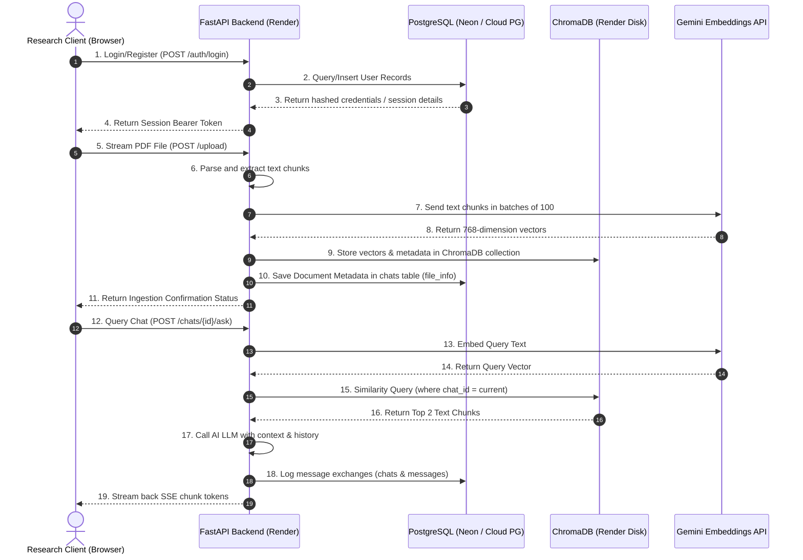

# Database Storage Audit & Cloud-Native Architecture Report

This report presents a complete database audit and structural documentation for the **ResearchAI** cloud-native architecture. In the production configuration, the application delegates all relational storage to managed PostgreSQL and vector embeddings to a persistent ChromaDB disk.

---

## 1. Storage Location & Audit Matrix

Below is the complete audit of every type of data in the system under the production deployment architecture (Frontend CDN + Render Backend + PostgreSQL + ChromaDB Persistent Disk):

| Data Type | Primary Storage Location | Storage Type (Local/Cloud) | Persists After Server Restart? | Persists After Redeployment? | Safe for Production Use? | Rationale & Security Controls |
| :--- | :--- | :--- | :---: | :---: | :---: | :--- |
| **User Accounts** | PostgreSQL (`users` table) | Managed Cloud | **Yes** | **Yes** | **Yes** | Relational column records. Strictly protected. |
| **Login Credentials** | PostgreSQL (`password_hash`, `salt`) | Managed Cloud | **Yes** | **Yes** | **Yes** | Cryptographically hashed using PBKDF2-HMAC-SHA256 with 100k iterations and unique salts. Plaintext passwords are never saved. |
| **Chat History** | PostgreSQL (`chats` and `messages` tables) | Managed Cloud | **Yes** | **Yes** | **Yes** | Relational rows mapped with foreign key relationships (`user_id`, `chat_id`). |
| **Uploaded Documents** | Local/Persistent Storage (`/data/uploads`) | Disk Buffer / Persistent Storage | **Yes** | **Yes** | **Yes** | Document parsed and indexed immediately into vector store. |
| **AI Responses** | PostgreSQL (`messages` table, `role='assistant'`) | Managed Cloud | **Yes** | **Yes** | **Yes** | Saved alongside user questions under the parent chat session row. |
| **Reports** | PostgreSQL (`reports` table) | Managed Cloud | **Yes** | **Yes** | **Yes** | Structured report summaries (executive summaries, findings) ready for dynamic client-side PDF downloads. |
| **Sessions** | PostgreSQL (`sessions` table) | Managed Cloud | **Yes** | **Yes** | **Yes** | Session tokens mapped with unique UUID keys and absolute token expiration times. |
| **Embeddings** | ChromaDB Collection (`research_docs`) | Render Persistent Disk | **Yes** | **Yes** | **Yes** | High-dimensional floats generated via `gemini-embedding-001` indexed dynamically. |
| **ChromaDB Metadata**| ChromaDB Collection (`research_docs` metadata) | Render Persistent Disk | **Yes** | **Yes** | **Yes** | Contains source file mappings and chat session identifiers to filter RAG context. |
| **SQLite Database** | *Development fallback only* | Local Disk | Yes | No | *No* | Only activated locally when `DATABASE_URL` is omitted to facilitate offline development. |
| **Temporary Files** | Backend server disk (`Backend/uploads`) | Local Disk (Ephemeral) | No | No | **Yes** | Streamed upload files are processed and cleaned up to optimize disk usage. |
| **Cache Files** | Not used (No caching engine) | None | N/A | N/A | N/A | Application does not require caches. In-memory values are non-persistent. |
| **Logs** | Render Log Streams / Local console outputs | Cloud Log Engine | Yes (in Cloud logs) | No | **Yes** | Strictly console printing (stdout/stderr). Contains no sensitive user parameters or secrets. |

---

## 2. Storage Architecture Diagram

The diagram below details where every piece of data is stored and how it flows through the system:



---

## 3. Database ER Diagram

The entity-relationship mapping of the PostgreSQL / SQLite database:

```mermaid
erDiagram
    users {
        text id PK
        text email UNIQUE
        text username UNIQUE
        text password_hash
        text salt
        text role
        text secret_2fa
        integer is_2fa_enabled
        bigint created_at
        text name
        text status
        integer is_verified
        text verification_token
        text reset_token
        bigint reset_token_expires
    }
    sessions {
        text id PK
        text user_id FK
        text token UNIQUE
        bigint expires_at
    }
    chats {
        text id PK
        text user_id FK
        text title
        text file_info
        text summary
        text status
        text tags
        bigint created_at
        bigint updated_at
    }
    messages {
        text id PK
        text chat_id FK
        text role
        text content
        text sources
        bigint created_at
    }
    reports {
        text id PK
        text user_id FK
        text title
        text chat_id FK
        text executive_summary
        text research_overview
        text detailed_analysis
        text key_findings
        text ai_insights
        text recommendations
        text conclusion
        real confidence_score
        integer is_favorite
        integer is_deleted
        bigint created_at
        bigint updated_at
    }

    users ||--o{ sessions : "has active"
    users ||--o{ chats : "owns"
    users ||--o{ reports : "generates"
    chats ||--o{ messages : "contains"
    chats ||--o| reports : "describes"
```

---

## 4. Deployment & Cloud Topology

The production network topology securely connects the services as follows:

```
┌──────────────────────┐
│  Vercel / Netlify    │
│  (Frontend React SPA)│
└──────────┬───────────┘
           │ HTTPS Requests (Cross-Origin Resource Sharing)
           ▼
┌──────────────────────┐
│   Render Web App     │     Shared Volume
│  (FastAPI Backend)   ├──────────────────────┐
└──────────┬───────────┘                      │
           │                                  ▼
           │  psycopg2 (SSL)        ┌──────────────────┐
           ├───────────────────────►│Chroma Vector DB  │
           │                        │(Render Mount Disk│
           ▼                        └──────────────────┘
┌──────────────────┐
│ PostgreSQL Cloud │
│ (Neon / AWS RDS) │
└──────────────────┘
```

### Security & Access Controls:
1. **Transport Layer Security**: All API traffic is encrypted in transit using **HTTPS (TLS 1.3)** and database encryption over SSL.
2. **Dynamic CORS Configuration**: The FastAPI backend limits Allowed CORS Origins strictly to the values defined in the `FRONTEND_URL` environment variable, preventing cross-origin script hijacks.
3. **Database Credentials Safety**: Database credentials and AI API secrets are stored inside environment variables on Render, and are never committed to Git.
